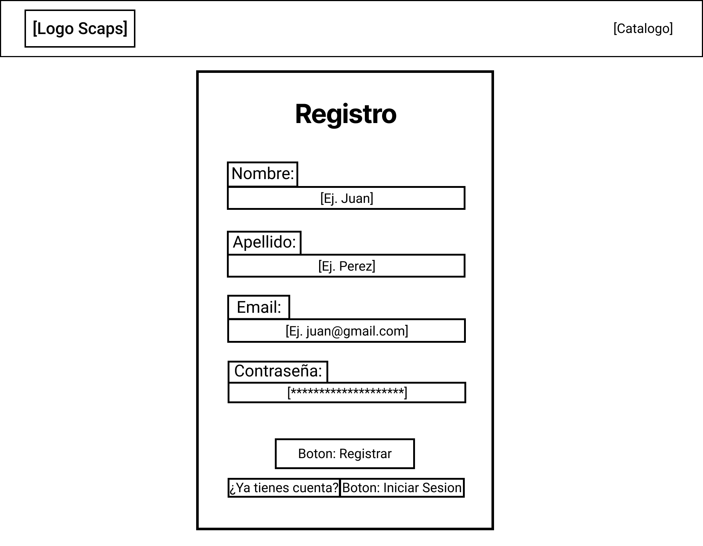
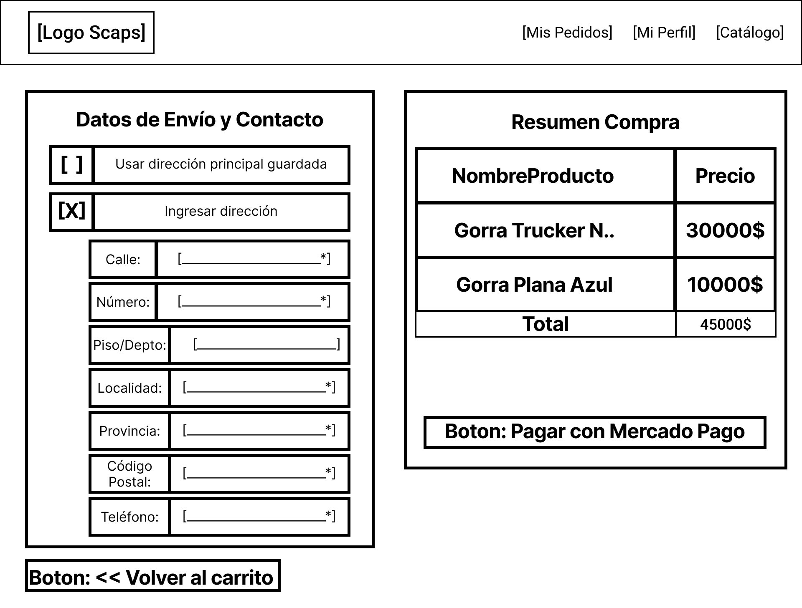
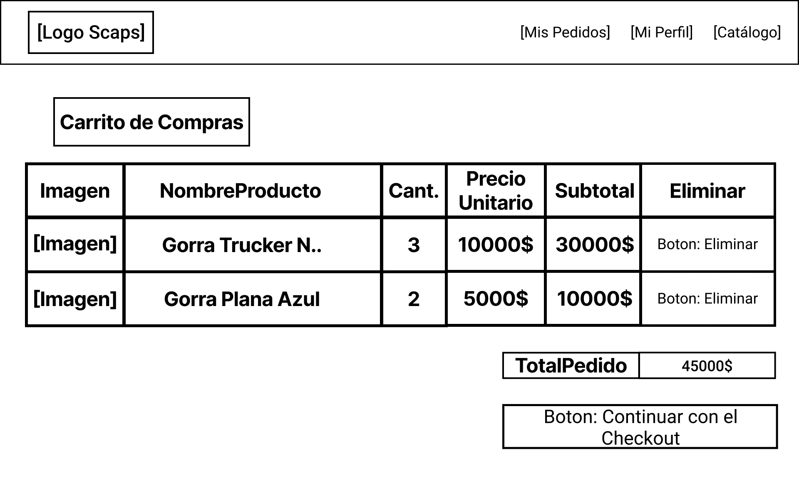
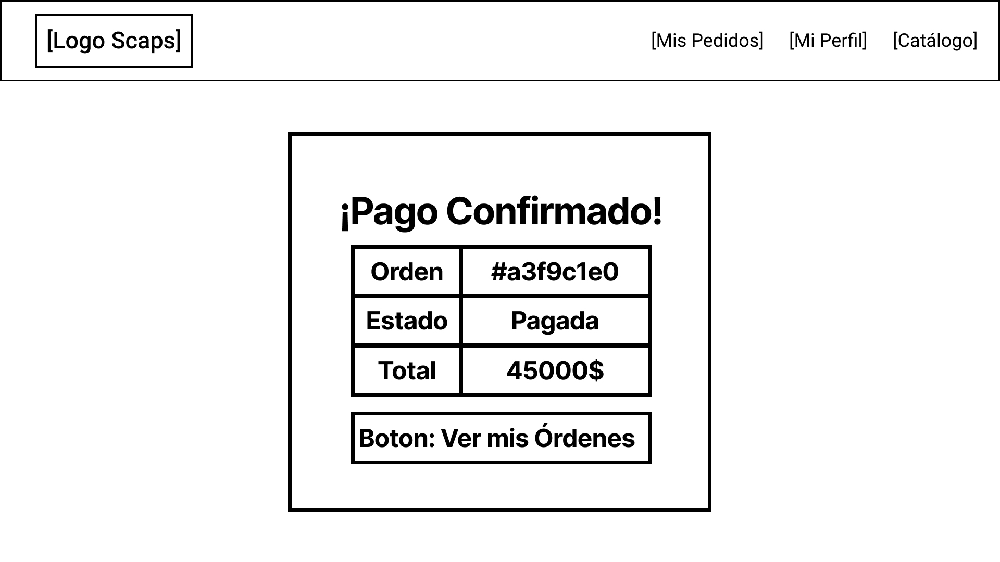
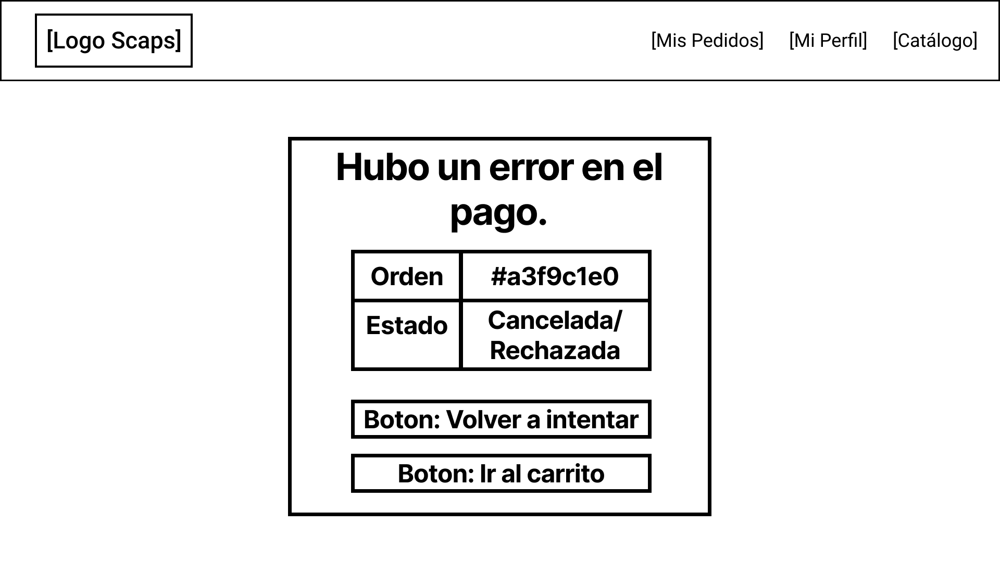
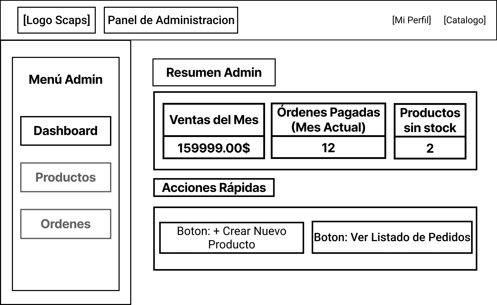
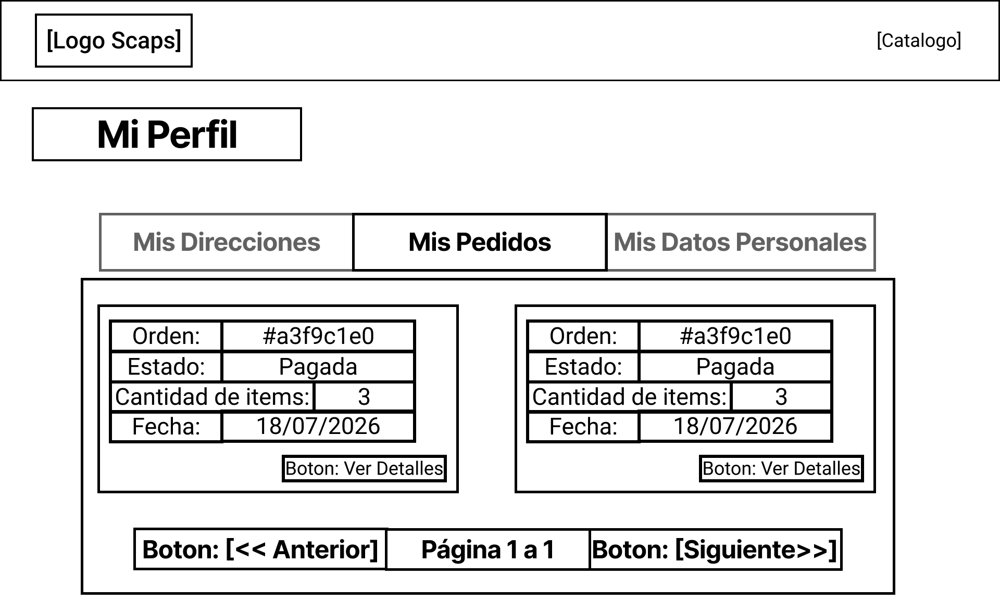
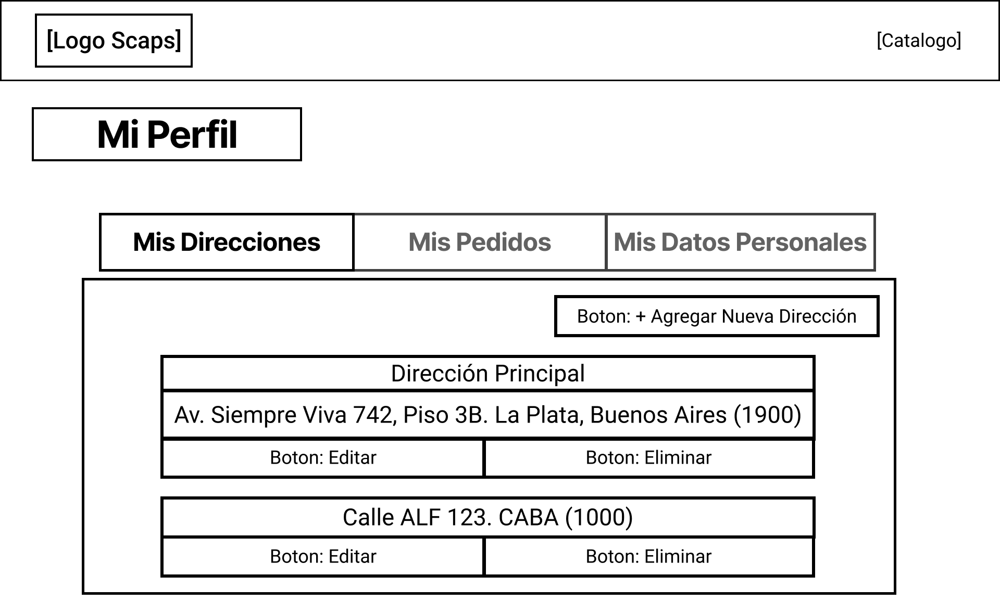

# Wireframes del MVP

Aquí están los bocetos estructurales de las pantallas principales:
**Pantallas incluidas:**
1. Landing (con CTA al catálogo)

2. Registro de cliente
3. 
4. Login

5. Catálogo en cards

7. Ficha de producto

8. Checkout

10. Carrito

11. Proceso Mercado Pago

13. Mercado Pago Exito

15. Mercado Pago Fallo

17. Dashboard (Panel Admin)

18. Menú Perfil - Pedidos

20. Menú Perfil - Direcciones

